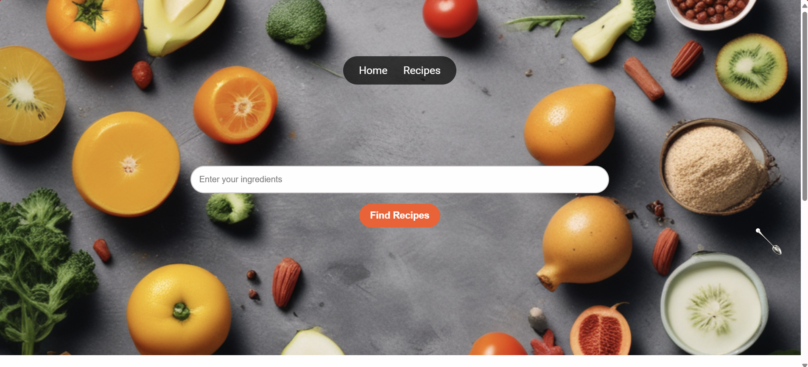

Hello! I'm Machavarapu Trisha, a passionate developer with knowledge of various programming languages.

## Projects

### Hand Gestures Code

Recipe finder is a website which is designed to be used for finding every possible recipe for given ingredients.

### Web Chat Application

<picture>
  <source media="(prefers-color-scheme: dark)" srcset="./images/Projects/web-chat.png">
  <source media="(prefers-color-scheme: light)" srcset="./images/Projects/web-chat-light.png">
  
</picture>

This project is a real-time web chat application built with modern web technologies. It demonstrates your proficiency in web development and real-time communication.

## Contact

- **Email:** trishamachavarapu123@gmail.com
- **GitHub:** [My Github Account](https://github.com/Trisha2301)
- **Instagram:** [My Instagram Account](https://www.instagram.com/mtrisha_23/)

## Github Stats

<picture>
  <source media="(prefers-color-scheme: dark)" srcset="https://github-readme-stats.vercel.app/api?username=Trisha2301&theme=blue-green&show_icons=true&hide_border=true&include_all_commits=true#">
  <source media="(prefers-color-scheme: light)" srcset="https://github-readme-stats.vercel.app/api?username=Trisha2301&theme=gruvbox_light &show_icons=true&hide_border=true&include_all_commits=true#gh">
  
</picture>

<picture>
  <source media="(prefers-color-scheme: dark)" srcset="https://github-readme-stats.vercel.app/api/top-langs/?username=Trisha2301&theme=blue-green&layout=donut&size_weight=0.5&count_weight=0.5&langs_count=20&hide_border=true#gh-dark-mode-only">
  <source media="(prefers-color-scheme: light)" srcset="https://github-readme-stats.vercel.app/api/top-langs/?username=Trisha2301&theme=vue&layout=donut&size_weight=0.5&count_weight=0.5&langs_count=20&hide_border=true#gh-light-mode-only">
  
</picture>

## GitHub Streak Stats

<picture>
  <source media="(prefers-color-scheme: dark)" srcset="https://github-readme-streak-stats.herokuapp.com/?user=Trisha2301&theme=midnight-purple&hide_border=true&date_format=M%20j%5B%2C%20Y%5D">
  <source media="(prefers-color-scheme: light)" srcset="https://github-readme-streak-stats.herokuapp.com?user=Trisha2301&theme=flag-india&hide_border=true&date_format=M%20j%5B%2C%20Y%5D">
  
</picture>

## 🏆 GitHub Trophies

  

## 🐍 Contribution Graph

<picture>
  <source media="(prefers-color-scheme: dark)" srcset="https://raw.githubusercontent.com/Trisha2301/Trisha2301/output/github-snake-dark.svg" />
  <source media="(prefers-color-scheme: light)" srcset="https://raw.githubusercontent.com/Trisha2301/Trisha2301/output/github-snake.svg" />
  
</picture>

## Github Top Repos

  <a href ="https://github.com/Trisha2301/Page-Replacement-Technique-in-java" >
<picture>
  <source media="(prefers-color-scheme: dark)" srcset="https://github-readme-stats.vercel.app/api/pin/?username=Trisha2301&theme=radical&repo=Page-Replacement-Technique-in-java&hide_border=true">
  <source media="(prefers-color-scheme: light)" srcset="https://github-readme-stats.vercel.app/api/pin/?username=Trisha2301&theme=gruvbox_light&repo=Page-Replacement-Technique-in-java&hide_border=false">
  
</picture>
  </a>
  <a href ="https://github.com/Trisha2301/Creating-Array-in-c-" >
<picture>
  <source media="(prefers-color-scheme: dark)" srcset="https://github-readme-stats.vercel.app/api/pin/?username=Trisha2301&theme=tokyonight&repo=Creating-Array-in-c-&hide_border=true">
  <source media="(prefers-color-scheme: light)" srcset="https://github-readme-stats.vercel.app/api/pin/?username=Trisha2301&theme=vue&repo=Creating-Array-in-c-&hide_border=false">
  
</picture>
  </a>
  <a href ="https://github.com/Trisha2301/Morse-Code-" >
<picture>
  <source media="(prefers-color-scheme: dark)" srcset="https://github-readme-stats.vercel.app/api/pin/?username=Trisha2301&theme=nightowl&repo=Morse-Code-&hide_border=true">
  <source media="(prefers-color-scheme: light)" srcset="https://github-readme-stats.vercel.app/api/pin/?username=Trisha2301&theme=buefy&repo=Morse-Code-&hide_border=false">
  
</picture>
</a>
  <a href ="https://github.com/Trisha2301/Hangman-game" >
<picture>
  <source media="(prefers-color-scheme: dark)" srcset="https://github-readme-stats.vercel.app/api/pin/?username=Trisha2301&theme=codeSTACKr&repo=Hangman-game&hide_border=true">
  <source media="(prefers-color-scheme: light)" srcset="https://github-readme-stats.vercel.app/api/pin/?username=Trisha2301&theme=solarized-light&repo=Hangman-game&hide_border=false">
  
</picture>
  </a>

## Skills

### Programming Languages

## Hobbies

- **Hobby One:** Learning new things.
- **Hobby Two:** Watching Thriller movies.
